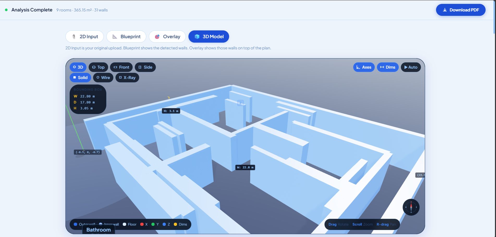

# ASIS: Autonomous Structural Intelligence System

## Project Description
ASIS is a full-stack dApp that bridges the gap between static 2D blueprints and interactive 3D structural data. It utilizes a Python-based OpenCV vision engine to parse uploaded architectural floor plans, extracting wall boundaries and structural segments. This data is fed into a React/Three.js frontend, dynamically extruding the coordinates into an interactive 3D model. 

## Project Vision
Our goal is to decentralize and automate architectural validation. By combining computer vision with smart contracts, we provide a "single source of truth" for structural designs. This ensures that what is planned on paper is accurately reflected in 3D and immutably logged on-chain, preventing unauthorized design alterations.

## Key Features
* **AI Vision Engine:** Powered by OpenCV for high-accuracy edge detection and structural boundary extraction from standard image files.
* **Interactive 3D Workspace:** A custom Three.js WebGL renderer that generates interactive 3D geometries from 2D coordinates in real-time.
* **On-Chain Verification:** Solidity smart contracts designed to log project milestones and verify design authenticity.
* **Dynamic Intelligence Dashboard:** Real-time metrics on material estimates and structural density.

## Deployed Smartcontract Details
*(Note: The smart contract is currently deployed on a local development network for testing.)*

* **Contract ID:** `Pending Testnet Deployment`
* **Network:** `Localhost (Hardhat/Foundry)`

### Blockexplorer Screenshot
*(Pending Testnet Deployment - Contract currently verified via local terminal logs)*

## UI Screenshots

*Caption: The main ASIS interface featuring the structural stats grid.*

*Caption: Real-time 3D extrusion generated via Three.js.*

## Project Setup Guide
Project Setup Guide
Getting ASIS running locally involves setting up the Python-based vision engine and the React-powered 3D dashboard.

1. Prerequisites
Make sure your environment has:

Node.js (v18 or higher)

Python (3.9 or higher)

Git

2. Installation & Environment
First, grab the code and move into the project directory:

Bash
git clone https://github.com/sanskritigupta312-jpg/ASIS-AI.git
cd ASIS-AI
3. Powering the Vision Engine (Backend)
The "brain" of this project uses OpenCV to parse floor plans. We recommend a virtual environment to keep things clean.

Create and start the environment:

Bash
python -m venv .venv
# Windows:
.venv\Scripts\activate
# Mac/Linux:
source .venv/bin/activate
Install the essentials:

Bash
pip install -r requirements.txt
Verify the pipeline: Run python test_floor.py to check if the OpenCV coordinate extraction is firing correctly.

4. Launching the 3D Workspace (Frontend)
The UI is a modern Vite/React app.

Bash
npm install
npm run dev
Once it's running, you can upload a schematic and watch the Three.js engine extrude the 3D model in real-time.

### Future Scope
ASIS is built to scale beyond simple 3D viewing. Here is what is on the roadmap:

-    BIM & CAD Export Pipeline: We are working on a direct export feature for .OBJ and .IFC formats. This allows architects to jump from ASIS directly into professional software like AutoCAD or Revit.

- Multi-Floor Sequencing: The next major update will allow users to upload multiple floor plans simultaneously, automatically "stacking" them to generate a full building skeleton.

- ML Material Analysis: We plan to integrate a machine learning layer to analyze structural density and provide instant, automated estimates for required construction materials like concrete and steel.

- On-Site AR Viewer: Leveraging WebXR to allow engineers to "project" the generated 3D structural models onto physical construction sites for real-world verification.

- Decentralized Collaboration: Enhancing our Solidity integration to allow multiple stakeholders to sign off on design milestones immutably on-chain.

